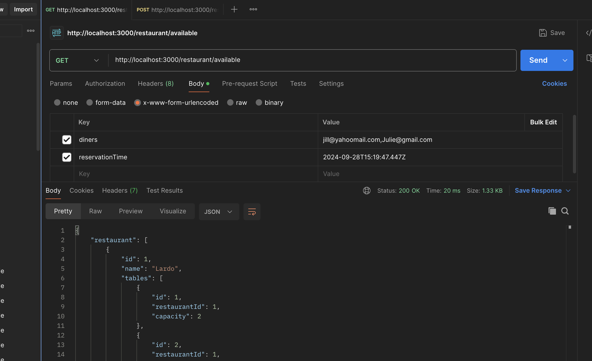

# restaurant_nelo

Restaurant

## Pre-requisite

### Install Docker Desktop on you windows or mac laptop

### Run the Docker Desktop application

## Dev mode Installtion

### Environment setup
- Copy the env file to save as `.env` by running following command
`cp sample.env .env`

### Build the app

Now go to the root directory of the project `restaurant_nelo` in the terminal and run following command

`docker-compose up --build`

### Migrate the prisma

Now we need to run following command in another terminal (if not run the previous docker-compose in detached mode)
`npm run prisma:migrate`

### Adding new diners and restaurants

#### New Diners
- Open `data/diners.csv` and add new diners by adding below new line
    - `Peter,Peter@gmail.com,"Paleo-friendly"`

#### New Restaurant
- Open `data/restaurant.csv` and add new diners by adding below new line
    - `Hello,5,2,1,"Paleo-friendly, Gluten Free Options"`

### Load Default DB data

Now load diners and restaurants from `data/diners.csv` and `data/restaurant.csv` by running following command
`npm run load-db`

This would load the default diners and restaurants to the DB

### Testing Endpoint

Install postman to test the endpoints

#### Get Available Restaurants


- You need to hit `http://localhost:3000/restaurant/available` endpoint with **GET** method
- Pass following `body` parameters
    - `diners: jill@yahoomail.com,Julie@gmail.com`
    - `reservationTime: 2024-09-28T15:19:47.447Z`
- Click `Send` button
- Verify the response below in `Body` tab
    ```
    {
        "restaurant": [
            {
                "id": 1,
                "name": "Lardo",
                "tables": [
                    {
                        "id": 1,
                        "restaurantId": 1,
                        "capacity": 2
                    },
                    {
                        "id": 2,
                        "restaurantId": 1,
                        "capacity": 2
                    },
                    {
                        "id": 3,
                        "restaurantId": 1,
                        "capacity": 2
                    },
                    {
                        "id": 4,
                        "restaurantId": 1,
                        "capacity": 2
                    },
                    {
                        "id": 5,
                        "restaurantId": 1,
                        "capacity": 4
                    },
                    {
                        "id": 6,
                        "restaurantId": 1,
                        "capacity": 4
                    },
                    {
                        "id": 7,
                        "restaurantId": 1,
                        "capacity": 6
                    }
                ],
                "endorsements": [
                    {
                        "restaurantId": 1,
                        "restrictionId": 1
                    }
                ]
            },
            {
                "id": 2,
                "name": "Panadería Rosetta",
                "tables": [
                    {
                        "id": 8,
                        "restaurantId": 2,
                        "capacity": 2
                    },
                    {
                        "id": 9,
                        "restaurantId": 2,
                        "capacity": 2
                    },
                    {
                        "id": 10,
                        "restaurantId": 2,
                        "capacity": 2
                    },
                    {
                        "id": 11,
                        "restaurantId": 2,
                        "capacity": 4
                    },
                    {
                        "id": 12,
                        "restaurantId": 2,
                        "capacity": 4
                    }
                ],
                "endorsements": [
                    {
                        "restaurantId": 2,
                        "restrictionId": 3
                    },
                    {
                        "restaurantId": 2,
                        "restrictionId": 1
                    }
                ]
            },
            {
                "id": 3,
                "name": "Tetetlán",
                "tables": [
                    {
                        "id": 13,
                        "restaurantId": 3,
                        "capacity": 2
                    },
                    {
                        "id": 14,
                        "restaurantId": 3,
                        "capacity": 2
                    },
                    {
                        "id": 15,
                        "restaurantId": 3,
                        "capacity": 2
                    },
                    {
                        "id": 16,
                        "restaurantId": 3,
                        "capacity": 2
                    },
                    {
                        "id": 17,
                        "restaurantId": 3,
                        "capacity": 4
                    },
                    {
                        "id": 18,
                        "restaurantId": 3,
                        "capacity": 4
                    },
                    {
                        "id": 19,
                        "restaurantId": 3,
                        "capacity": 6
                    }
                ],
                "endorsements": [
                    {
                        "restaurantId": 3,
                        "restrictionId": 2
                    },
                    {
                        "restaurantId": 3,
                        "restrictionId": 1
                    }
                ]
            }
        ]
    }
    ```
- Try with un-registered email id or non-formatted time to see error cases

#### Create Reservation


- You need to hit `http://localhost:3000/reservations` endpoint with **POST** method
- Pass following `body` parameters
    - `diners: jill@yahoomail.com,Julie@gmail.com`
    - `reservationTime: 2024-09-28T17:19:47.447Z`
    - `tableId: 3`
- Click `Send` button
- Verify the response below in `Body` tab
    ```
    {
        "diners": [
            "Success"
        ]
    }
    ```
- Try with un-registered email id or non-formatted time or wrong formatted table id to see error cases

### Unit testing

Run following command to run the unit tests
`npm run test`

### Prettyfying the code

Run following command to prettyfy the code
`npm run format`

## Prod mode

Run in non development mode
